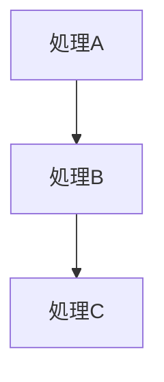
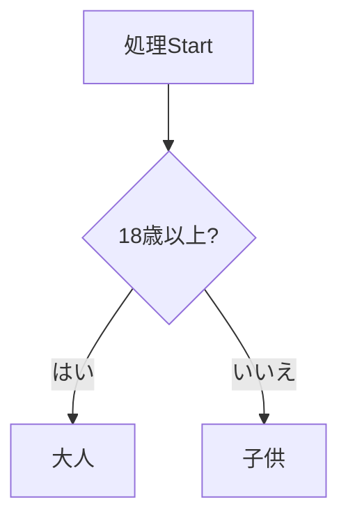
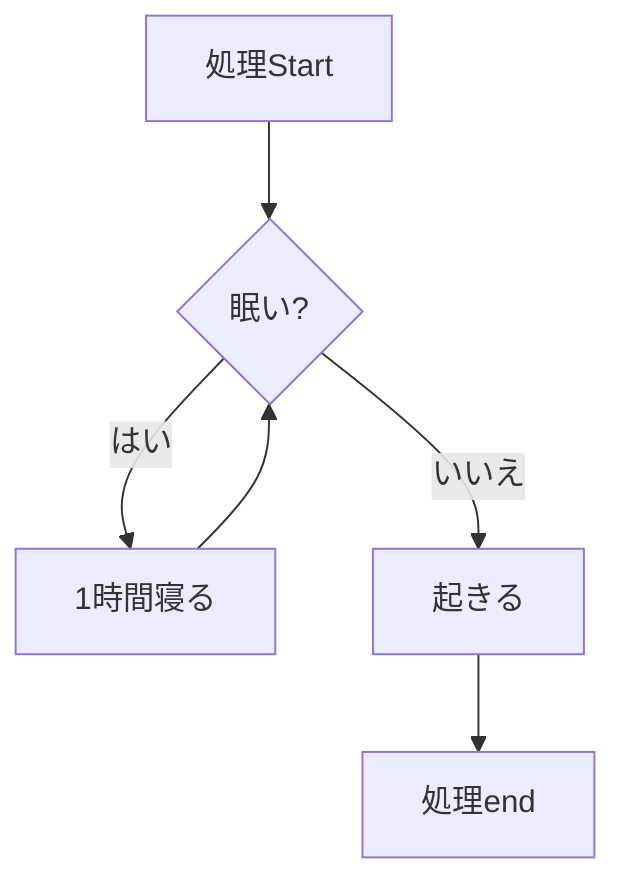

## 取り組んだ課題一覧

- :construction: タイピング、linuxWeb最強問題集10問、、docker-docs1パート、読書 :tomato:1
- Railsプロジェクトのdocker化、記事作成、URL提出 12:tomato:6(累計32)(38合計)
- Rubyのプログラミング初心者向けの超入門講座 2:tomato:4

## わかったこと

- syntax highlightをcode blockにつける方法
- プログラムの基本構造はシンプル、1順次実行、2条件分岐、３繰り返し、この３つでできている

1順次実行

2条件分岐

- (if,elsif,else,end)

3繰り返し

- (for, in, end)(for,in,end)(break,next,)(for,forネスト)(rubyにi++はない)

- 処理を図で表す方法がわかった
- 変数は箱
- オブジェクト(rubyでは全ての値がオブジェクト,オブジェクトはクラスから作ることができる、何らかのクラスに所属している),インスタンスもほぼ同じ意味
- 配列とは複数のデータを入れることができる１階立てのアパート(それぞれの部屋には部屋番号(インデックス、添字)が割り当てられている、一番端から0,1,2,3と数える、インデックス = 順番-1), [data1,data2]
- 多次元配列は２階建以上のアパート,arr =  [ [101,102],[201,202] ], (arr[0][0]は101, arr[1][0]は201)
- 演算子(+,-,*,/,%)、関係演算子(>,<,<=,=>,==,!=)、論理演算子(&&,||)、代入演算子(=,+=)
- :wrench: command + shift + pでvscodeのコマンドパレットを開ける
- メソッド(同じものを２度書く必要がない、同じものを他の場面で使える、他の人も使うことができる), def (引数)end
- 変数はクラスの外、インスタンス変数はクラスの中
- 関数メソッドはクラスの外、インスタンスメソッドはクラスの中
- クラスはデータと処理をまとめたもの(class,end)(initialize,@変数,attr_accessor)(クラスは定義しておけば後からいくらでもインスタンスを作ることができる=>再利用可能)

## 次やること

- Rubyのプログラミング初心者向けの超入門講座 2:tomato:
- プロを目指す人のためのRuby入門を読む、感想をブログに書く、URLを提出(537p,13章,1章:tomato:×2,1p=1~2min) 21:tomato:
- rubocopについて調べて適用する 1:tomato:
- rubyグループ分け問題 3:tomato:
- Rubyでカレンダーを作る 6:tomato:
- :black_cat:
- rubyでゴルフスコア判定 6:tomato:
- オブジェクト指向Ruby 自販機問題 10:tomato:
- ポケモンで学ぶ！クラスとオブジェクト指向 12:tomato:

## 感じたこと

- ブログを誰かに見てもらえるのは嬉しいと感じた
- プログラミングは難しそうに見えて実は３つの処理だけでできてるんだなと感じました
- 図をmermaid記法で表すと繋がりが明瞭になると感じました、頭を使ってる感じがしました
- <https://toyokeizai.net/articles/-/233465> この記事を読んで何かを感じた
- 朝早く起きないと学習時間も少ないし、集中もできていないと感じた
- 決まった時間に寝て起きることが大切だと感じた

## 学習時間

- Today：5h
- Total：82.5h
