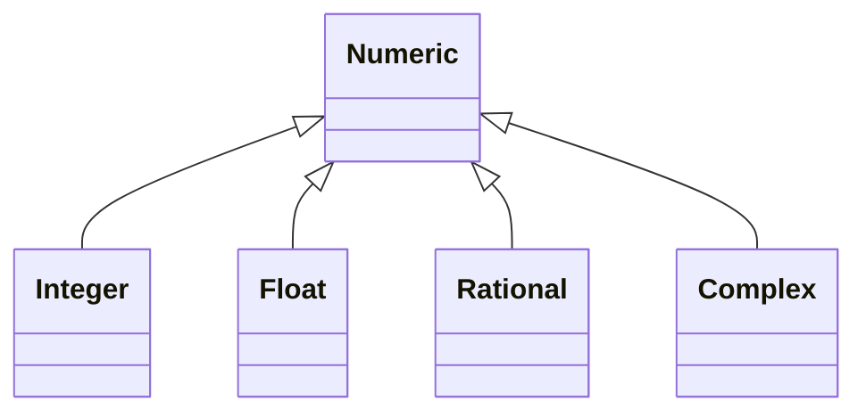
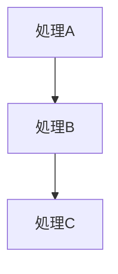
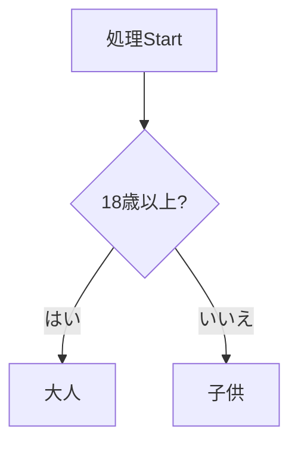
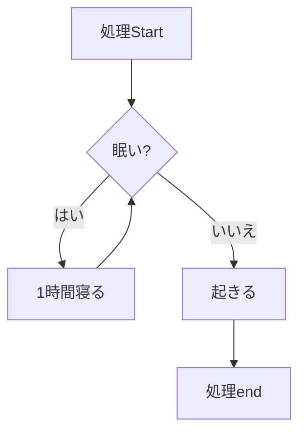

## 取り組んだ課題一覧

- :construction: タイピング、linuxWeb最強問題集10問、、docker-docs1パート、読書 :tomato:1
- プロを目指す人のためのRuby入門を読む、感想をブログに書く、URLを提出(537p,13章,1章:tomato:×2,1p=1~2min) 21:tomato:16

## わかったこと

- :wrench: コメントアウト(cmd + /)
- :wrench: 一括コメントアウト(cmd + a && cmd + /)
- :wrench: 短形選択(始点をクリックしてから、終点を［Shift］＋［Option］＋左クリック)
- :wrench: タブ移動(ctrl + tab)
- :wrench: 右２列レイアウト(ctrl + ¥)
- :wrench: ファイル名検索(cmd + p)
- :wrench: コマンドパレットを開く(cmd + shift + p)
- :wrench: vscodeでterminalトグル(cmd + j)
- ruby,引数の括弧は省略できる(require,raise,puts,p,引数なし関数)
- ruby, ;コロンはなくて良い
- ruby, 変数やメソッド、クラスにつける名前のことを識別子と呼ぶ
- ruby, 予約語は識別子として使えない
- ruby, メソッド呼び出しのカッコはスペースを空けると構文エラーが発生する
- ruby, リテラル,ソースコードに直接埋め込むことができる値のこと
- ruby, 変数を宣言するには何かしらの値を代入する必要がある
- ruby, 変数はスネークケース, special_price
- ruby, 多重代入、a,b = 1,2(a=>1,b=>2)、c,d = 10(c=>10,d=>nil)、a=b=100(a=>100,b=>100)参照の概念を理解しないと予期せぬ不具合の原因になる
- ruby, 式展開と特殊文字を使うならダブルクォート
- ruby, 特別な意味を持つ文字の機能を打ち消し、ただの文字として扱えるようにすることをエスケープ処理と言います
- ruby, 数値に_を含めることができる。_は無視される。(10_00 #=> 1000)変数の手前に-をつけると数値の正と負が反転する
- ruby, 整数同士の割り算は整数になる。小数点以下は切り捨て(1 / 2 =>0, 1.0 / 2 => 0.5)
- ruby, n.to_fでnに入ってる整数を小数に変更できる
- ruby, %は割り算のあまり、**は冪乗(べきじょう)
- ruby, *,/は+,-よりも優先順位が高い,()を使うと優先順位を変えられる
- ruby, 変数の値を増減させる++,--はない、+=,-=をつかうべし
- ruby, 数値と文字列は暗黙的に変換されない、to_i, to_f,to_sを使うべし
- ruby, 小数、丸め誤差あり、Rationalクラス(有理数)、0.1r * 3.0r => 3/10, 0.1 * 3.0 =>0.30000000000000004
- ruby, falseまたはnil =>偽, それ以外全て=>真
- ruby, &&の優先順位は||より高い
- ruby, !演算子を使うと真偽値を反転させられる(-を使うと数値の正と負が反転する)
- ruby, if文は最後に評価された値を戻り値として返す
- ruby,   else節がなく、どの条件にも合致しなかった場合はnilを返す
- ruby,   後置if
- ruby,   if,elsifの後ろにthenを入れられる(あんま使わない)
- ruby, defでメソッド定義、メソッド名も変数名と同じ小文字のスネークケース
- ruby, 最後に評価された式がメソッドの戻り値になる(メソッドの中に何も書かなければ戻り値はnil)=> returnを使わない書き方が主流
- ruby, returnはメソッドを途中で脱出する場合に使用されることが多い
- ruby, 引数がない場合は()をつけないほうが主流
- ruby, 引数がある場合は()をつけるほうが主流
- ruby, irbでメソッド名やクラスを入力してtabを２回押すと、APIドキュメントを表示してくれる
- ruby, 文字列はStringクラス、%記法もある、複数行の長い文字列にはヒアドキュメント <<TEXT    TEXT
- ruby, フォーマットを指定して文字列を作成する, sprintfメソッド
- ruby, 123.to_s => "123", [10,20,30].join => "102030", 'hi!' * 3 => "hi!hi!hi!"
- ruby, 1文字でも2文字でも0文字でも全部文字列、文字と文字列を区別しない
- ruby, 整数はInteger, 小数はFloat

- ruby, 式全体が真または偽であることが決定するまで左から順に指揮を評価する
- ruby, user.valid? && send_email_to(user), 正常なユーザであればメールを送信する
- ruby, user = find('tom') || find('alice') || find('bob'), 左から順に検索して、最初に見つかったユーザを変数に格納する
- ruby, and,or,notは演算子の優先順位が違う、&& || と全く同じように使えない
- ruby, and,orは条件分岐ではなく制御フローを扱うのに向いている
-   A and B 「Aが真か？真ならばBせよ」
-   A or B 「Aが真か？真でなければBせよ」
- ruby, unless 条件式(条件式が偽の場合だけ処理を実行する)
- ruby, 条件式に==true , ==false,==nilを書くことはあまりない
- ruby case文,when, breakは必要ない,case文も最後に評価された式を戻り値として返す
- ruby, 三項演算子, 式 ? 真だった場合の処理 : 偽だった場合の処理
- ruby, デフォルト値付きの引数, defメソッド(引数 = デフォルト値)(デフォルト値には動的に変わる値Time.nowや他のメソッドの戻り値hello()を指定できる)
- ruby, 述語メソッド, ?で終わるメソッドは慣習として真偽値を返すメソッド
- ruby, 述語メソッド, !で終わるメソッドは慣習として呼び出したオブジェクトの状態を変更してしまう(破壊的メソッド)
- ruby, エンドレスメソッド, endを省略して１行でメソッドを定義できる(メソッド名と=の間にスペースがないとエラー,引数の()を省略するとエラー),def greet = 'hello!'
- ruby, ガベージコレクション(GC)Rubyは使用されなくなったオブジェクトを回収し、自動的にメモリを解放します。このため、プログラマはメモリ管理を意識する必要がありません。
- ruby, エイリアスメソッド, Stringクラスのlengthメソッドとsizeメソッドは名前が違うだけで全く同じメソッド,同じ実装 異なる名前をエイリアスメソッドと呼ぶ
- ruby, 式(Expression)と文(Statement)、「値を返し、結果を変数に代入できるものが式」、「値を返さず、変数に代入しようとすると構文エラーになるものが文」
-     rubyのifやメソッド定義は値を返すので式(空のifもメソッドもnilが戻り値)
- ruby, 擬似変数(nil,true,false,self,__FILE__,__LINE__,__ENCODING__)
- ruby, 異なる変数が同じオブジェクトを参照しているかどうかはobject_idメソッドでわかる,a.equal?(b)でも同じオブジェクトかどうか確認できる
- ruby, 同じオブジェクトを参照している場合、オブジェクトの状態が変更されると、その変更がそのまま各変数に影響します。
- ruby, 組み込みライブラリ、標準ライブラリ、gem
- ruby, gemになっていればgem install \<gem>でいち早く不具合修正板を入手できる可能性がある
- ruby, 組み込みライブラリでない場合はrequire ライブラリ名で明示的にそのライブラリを読み込む必要がある(dateは読み込む必要がある)
- ruby, 自分が作成したRubyプログラムを読み込む場合はrequire_relativeで自ファイルからの相対パスで読み込むファイルを指定します。(拡張子の.rbは省略可能)
- ruby, puts(改行を加えて出力、戻り値はnil),print(改行されずに出力、戻り値はnil),p(改行を加えて出力、戻り値は引数で渡されたオブジェクトそのもの),pp(大きくて複雑な配列やハッシュ、オブジェクトの内容を見やすく整形して出力する,戻り値は引数としてされたオブジェクトそのもの)p,ppは開発者向け(なぜなら文字列変換にto_sではなくinspectを用いるから)
- 怠惰、短期、傲慢
- 怠惰は「全体の労力を減らすために手間を惜しまない気質」を指す
- 短期は「コンピュータの動作が怠慢な時に感じる怒り」を指す
- 傲慢は「自分の書いたプログラムは誰に見せても恥ずかしくないと胸を張って言える自尊心」を指す
- 自動テストを書くことで目視で間違いを探す手間を省ける(1プログラムの実行結果を検証するテストコードを書く->2テストコードを実行する->3テスティングフレームワークが実行結果をチェックし、その結果が正しいか間違っているかを報告する)
- テストファイル名(calendar_test.rb)->テストクラス名(CalendarTest)、ファイル名はスネークケース、クラス名はキャメルケース
- Minitestはtest_で始まるメソッドを探してそれを実行します。なのでメソッド名をtest_で始めることが必須である。
-   assert_equal 期待する結果,  テスト対処となる値や式
- assert_equal b, a (aがbと等しければパスする)
- assert a (aが真であればパスする)
- refute a (aが偽であればパスする)
- runs :実行したテストメソッドの件数, assertions:実行した検証メソッドの件数,failures:検証に失敗したテストメソッドの件数,errors:検証中にエラーが発生したテストメソッドの件数,skips:skipメソッドにより実行をスキップされたテストメソッドの件数
- テストメソッドの、あるassertionが失敗またはエラーになった場合、そのassertionの下にあるassertionは処理されない。

- 配列とは複数のデータをまとめて格納できるオブジェクトのこと。配列内のデータ(要素)は順番に並んでいて、添え字(インデックス)を指定することでそのデータを取り出すことができます。[]と,を使って作成する(配列リテラル)、異なるデータ型を格納できます。
- 配列で存在しない要素を指定した場合nilが返ります
- a = [], a << 1でa配列の最後に1を追加できる,a.delete_at(0)で引数に渡したインデックスの要素を削除できる
- 配列を使って多重代入できる。(a,b = [1,2] 、 c,d =[10] c=>10,d=>nil,右辺の要素が多い場合ははみ出した値が切り捨てられる)
- :bulb: ブロックはメソッドの引数として渡すことができる処理のかたまりです。ブロック内で記述した処理に応じてメソッドから呼び出されます。
- コールバック関数とは、プログラムにおいて他の関数やイベントハンドラに渡される関数のことを指します。
- for式は言語機能の繰り返し処理, eachは配列のメソッド
- javascriptのforEachメソッドではコールバック関数をforEachメソッドの引数として渡していましたが、Rubyではコールバック関数ではなくブロックを使うのが大きな特徴。ただし、コールバック関数と異なり、メソッドに渡せるブロックの数は１つ
- eachメソッドの役割は配列の要素を最初から最後まで順番に取り出すこと
- 取り出した要素をどう扱うかはブロックに記述する
- numbers.each do |n| sum+= n end
- ブロックパラメータ、nの値はなんでもいいiでもnumでも
- ブロックパラメータをを使わない場合はブロックパラメータ自体を省略可
- numbers.each do sum += 1 end
- do~endまでをブロックと呼ぶ、eachとブロックは役割分担している
- numbers.delete_if do |n| n.odd? end
- eachは渡す役割だけ、delete_ifは渡す && 戻り値をチェックして真だったら、ブロックに渡した要素を配列から削除する
- このように、Rubyでは「用件を問わず共通する処理」はメソッド自身に、「用件によって異なる処理」はブロックにそれぞれ担当させ、１つの処理を完了させるメソッドが数多く用意されている
- 変数のスコープ(有効範囲), ブロック内で初めて定義したら、そのブロック内でのみ使える
- ブロックパラメータの名前をブロックの外にある変数の名前と同じにすると、ブロック内ではブロックパラメータの値が優先される(名前の重複により、他の変数やメソッドが参照できなくなることをシャドーイングといいます)
- 改行入れなくてもブロックは動作する
- numbers.each do |n| sum += end
- do ... endを使う代わりに、{ ... }で囲んでもブロックを作れる
- numbers.each { |n| sum += n }
- mapメソッド(エイリアスメソッドはcollect)、各要素に対してブロックを評価した結果を新しい配列にして返します。
- mapメソッドを使うとブロックの戻り値が配列の要素となる新しい配列が作成されるため、mapメソッドの戻り値をそのまま新しい変数に入れることができる
- new_numbers = numbers.map { |n| n * 10}
- selectメソッド(エイリアスメソッドはfind_all)、各要素に対してブロックを評価し、その戻り値が真の要素を集めた配列を返すメソッド
- even_numbers = numbers.select {|n| n.even? }
- rejectメソッドはselectメソッドの反対で、ブロックの戻り値が真になった要素を除外した配列を返します。ブロックの戻り値が偽である要素を集めるメソッドです
- findメソッド(エイリアスメソッドはdetect)、ブロックの戻り値が真になった最初の要素を返します。
- sumメソッドは要素の合計を求めるメソッド、ブロックを与えると、ブロックパラメータに各要素が順番に渡され、ブロックの戻り値が合計されます
- numbers = [1,2,3]
- numbers.sum(5) #=> (5+1+2+3)引数の初期値は0
- chars = ['a','b','c']
- chars.sum('') #=> (''+'a'+'b'+'c') #=> 'abc'
- chars.join #=> 'abc'
- chars.join(-) #=>'a-b-c' (連結する際はto_sメソッドで各要素を文字列に変換してから連結します)
- chars.sum('>') { |c| c.upcase } #=> '>ABC'
- ['ruby','java','python'].map { |s| s.upcase } #=>["RUBY","JAVA","PYTHON"], 下の記述と同意
- ['ruby','java','python'].map(&:upcase) #=>["RUBY","JAVA","PYTHON"], 上の記述と同意
- [1,2,3,4,5,6].select {|n| n.odd?} #=> [1,3,5]
- [1,2,3,4,5,6].select(&:odd?) #=> [1,3,5]
- &:メソッド名 記法は以下の条件が揃った時に使うことができる(1ブロックパラメータが一個だけである,2ブロックの中で呼び出すメソッドには引数がない,3ブロックの中では、ブロックパラメータに対してメソッドを一回呼び出す以外の処理がない)
- &:upcaseや&:odd?のうち、:upcaseや:odd?の部分はシンボルと呼ばれるオブジェクトになっている

1順次実行

2条件分岐

3繰り返し

## 次やること

- プロを目指す人のためのRuby入門を読む、感想をブログに書く、URLを提出(537p,13章,1章:tomato:×2,1p=1~2min) 21:tomato:(累計16)
- rubocopについて調べて適用する 1:tomato:
- rubyグループ分け問題 3:tomato:
- :black_cat:
- Rubyでカレンダーを作る 6:tomato:
- rubyでゴルフスコア判定 6:tomato:
- オブジェクト指向Ruby 自販機問題 10:tomato:
- ポケモンで学ぶ！クラスとオブジェクト指向 12:tomato:

## 感じたこと

- 無心でやるしかないと感じた
- はじめてしまえば勝てると感じた
- インプットの時はlofi,アウトプットの時はテンションの上がる曲がいいと感じた
- 体力がなくて8hが今の限界っぽいからランニングや運動で体力をつけなければと感じた
- フロー状態に入れてた気がする、難易度が丁度良いのだと感じた
- ショートカットは最初は少し大変だけど、使うほど生産性が上がっていくと感じた
- 用語を理解した上で説明できる程度まで効率良く覚えていけたらいいなと感じた

## 学習時間

- Today：8h
- Total：92.5h
