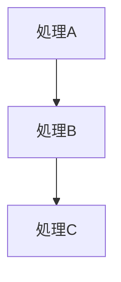
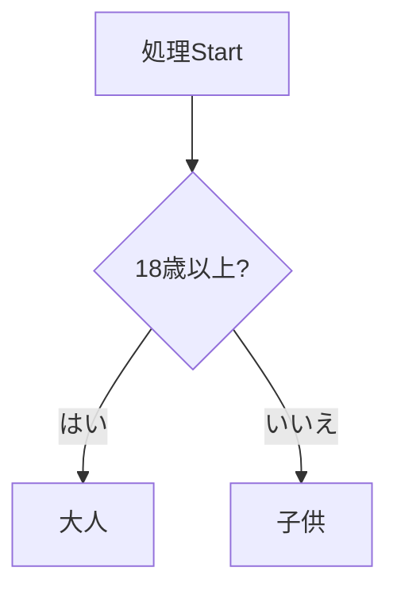
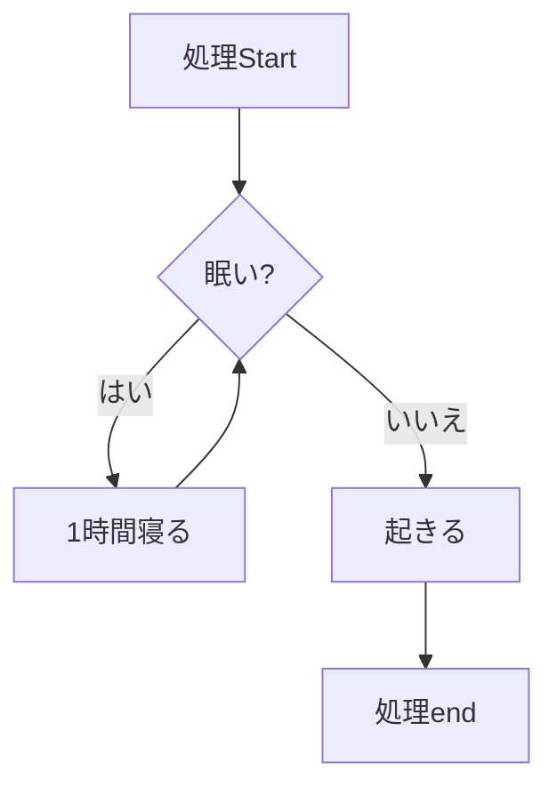

## 取り組んだ課題一覧

- :construction: タイピング、linuxWeb最強問題集10問、docker-docs1パート、読書 :tomato:1
- どうやって実装してらいいかを書き出してみた

## わかったこと

- BIOS（Basic I/O System）は最もハードウェアに近い部分を司るシステムで、物理的なハードウェア（マザーボード）上に書き込まれています
- OpenSSHはLinuxで通常使われるSSHのソフトウェア
- スマホからgithubのrepositoryを作れる
- スマホからgithubのissueを立てられる
- スマホからgithubのissueに作業を記述することができる
- アウトプットに至るまでのプロセスを書き出すことに価値がある(フリーターにとっては)

1順次実行

2条件分岐

3繰り返し

## 次やること

- プロを目指す人のためのRuby入門を読む、感想をブログに書く、URLを提出(537p,13章,1章:tomato:×2,1p=1~2min) 21:tomato:(累計16)(合計)
- rubocopについて調べて適用する 1:tomato:
- rubyグループ分け問題 3:tomato:
- :black_cat:
- Rubyでカレンダーを作る 6:tomato:
- rubyでゴルフスコア判定 6:tomato:
- オブジェクト指向Ruby 自販機問題 10:tomato:
- ポケモンで学ぶ！クラスとオブジェクト指向 12:tomato:

## 感じたこと

- 仕事と作業の違いを記事で読んだ。今まで自分はバイトなどで店長などが考えた作業を行なっていたのだなと感じた
- 外で人と会うのはいいなと感じた
- hello worldって感じの1日だった

## 学習時間

- Today：2h
- Total：94.5h
