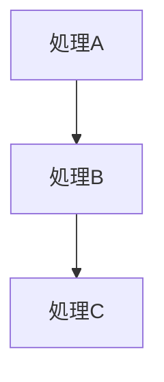
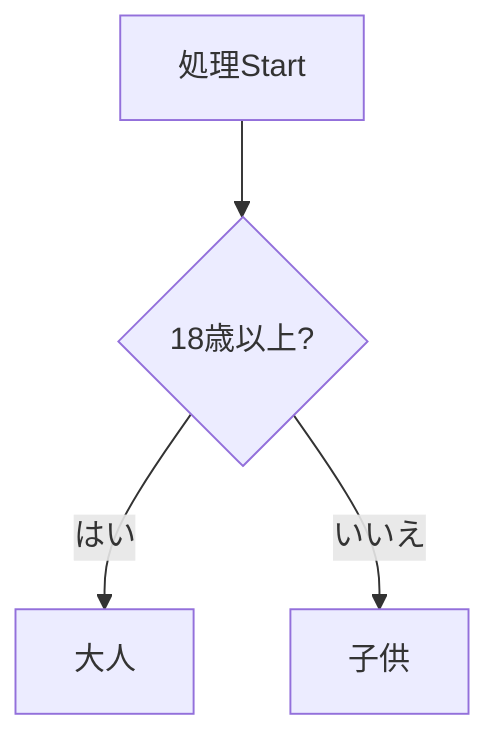
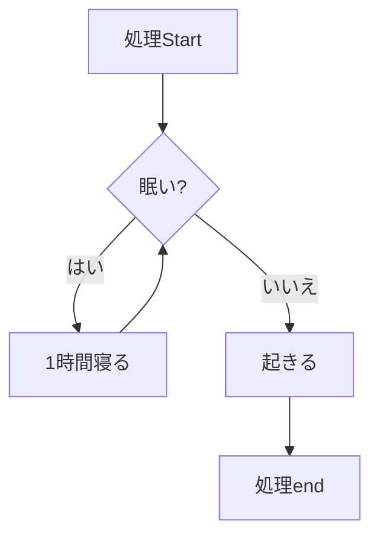

## 取り組んだ課題一覧

- プロトタイピング:tomato:2

## わかったこと

- １つ１つの処理が予想通りに動いているかをputsで確認しながらでないと、予想通りに動かなかった時にどこで問題が発生しているかの特定が困難になることが分かった

1順次実行

2条件分岐

3繰り返し

## 次やること

- プロを目指す人のためのRuby入門を読む、感想をブログに書く、URLを提出(537p,13章,1章:tomato:×2,1p=1~2min) 21:tomato:(累計16)(合計)
- rubocopについて調べて適用する 1:tomato:
- rubyグループ分け問題 3:tomato:
- :black_cat:
- Rubyでカレンダーを作る 6:tomato:
- rubyでゴルフスコア判定 6:tomato:
- オブジェクト指向Ruby 自販機問題 10:tomato:
- ポケモンで学ぶ！クラスとオブジェクト指向 12:tomato:

## 感じたこと

- 早く働き始めたいと感じた

## 学習時間

- Today：1h
- Total：95.5h
